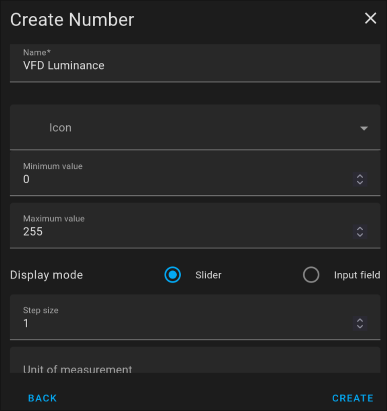

# Home Assistant VFD Dashboard

A convenient way to display your entity state from Home Assistant on a beautiful VFD.

This project uses an `ESP32C3` to drive a `CU40026MCPB-S35A` VFD over serial.

## Details

Edit `config.rs` to set the appropriate Wi-Fi and Home Assistant API settings as well as to set up the entities that you want to display.

GPIO 4 is used for serial TX.

## Luminance

If you want to control the luminance of the display from Home Assistant you can create a helper entity of type `Number` with the minimum value of 0 and the maximum value of 255 and set its entity ID in the config.

## Build Tips

There is some space on the back of the display where you can use hot glue to attach an `ESP32C3 Super Mini` as shown below.

